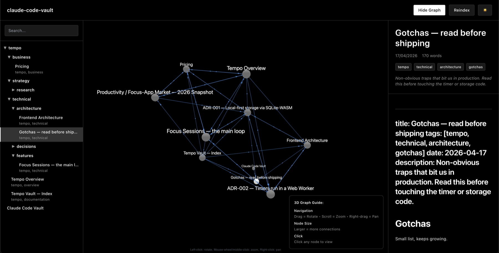
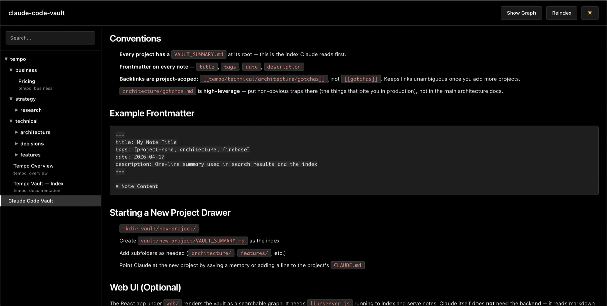

<div align="center">

# claude-code-vault

**A markdown knowledge vault designed for Claude.**

[](https://www.npmjs.com/package/claude-code-vault)
[](https://github.com/bernabranco/claude-code-vault/actions/workflows/ci.yml)
[](LICENSE)
[](package.json)
[](https://modelcontextprotocol.io)


</div>

---

Most PKM tools (Obsidian, Logseq, Notion) were built for humans writing notes; LLM features are bolted on as plugins. `claude-code-vault` starts from the other direction: **what would a knowledge base look like if an LLM agent was the primary consumer?**

The name points at the first-class integration (Claude Code + MCP), but the vault itself is plain markdown with YAML frontmatter and wiki-links. Any [MCP-compatible](https://modelcontextprotocol.io) client can load the same tool surface, and any agent that can read files can use the vault directly — no Claude required. This repo just ships the Claude Code wiring out of the box.

## Design principle: LLM-first documentation

The bet: LLMs will be the primary executors of code-implementation tasks. If that's true, documentation should be optimized for **LLM consumption**, not human browsing. Human readability is a welcome side effect, not the goal.

In practice that means:

- **Explicit invariants over implied ones.** Say "`VAULT_DIR` env var wins" in a heading, not "usually you'd set the path." Retrievers anchor on explicit claims; implied knowledge doesn't chunk.
- **Stable headings as addresses.** Chunks are retrieved by heading breadcrumb. Renaming a heading is a URL change — treat it that way.
- **Cross-references an agent can follow.** Wiki-links (`[[claude-code-vault/gotchas/gotchas]]`) are deterministic lookups, not decorative. Every concept that matters gets its own note so another note can link to it.
- **Frontmatter carries routing metadata.** `title`, `tags`, `description`, `date` — structured fields the indexer and retriever use, not styling for humans.
- **One concept per note.** Longer notes dilute chunk relevance. If a section starts drifting into a second topic, split it and link.
- **Gotchas are first-class.** Non-obvious traps belong in a dedicated `gotchas.md` so a retrieval on "why does X fail under Y" actually surfaces them.

Every feature in the [roadmap](#roadmap) is evaluated against one question: *does this make it easier for an LLM to find and use the right context?* Nicer human UX is fine only when it doesn't cost LLM precision.

Browse the self-docs vault at [`vault/claude-code-vault/`](vault/claude-code-vault/) — this project documents itself using its own tool, with ADRs, architecture notes, features, gotchas, and research all wiki-linked into a real graph. The vault doubles as a test fixture for the retrieval eval harness.

> ⚠️ **Status: early, personal tool.** See the [roadmap](#roadmap) for what's built vs. planned.

<p align="center">
  
  <br />
  <sub><em>The self-docs vault rendered as a graph — every wiki-link becomes an edge, every note a node. Click to read.</em></sub>
</p>

## How it looks in practice

Walk-through using the self-docs vault. Imagine you've just opened Claude Code in this repo and asked about the project.

### "What's this project?"
Claude calls `vault_read("claude-code-vault/overview")`. Gets the overview + wiki-links pointing at the ADRs, architecture, features, and research. Claude now knows where to look next — no grepping required.

### "Why did we pick local embeddings over a remote API?"
The query rephrases how the ADR is written. Claude calls `vault_semantic_search("why did we pick local DB")` → top hit is [`adr-001-local-first-embeddings`](vault/claude-code-vault/adrs/adr-001-local-first-embeddings.md), best-chunk heading `ADR-001 > Rationale`. **Meaning-based retrieval**, not substring matching.

### "Where's the cache-filename-bump gotcha?"
Claude doesn't want the whole [`gotchas.md`](vault/claude-code-vault/gotchas/gotchas.md) file — just the relevant paragraph. `vault_search_chunks("cache filename bump on schema changes")` returns the exact passage with breadcrumb `Gotchas > CREATE TABLE IF NOT EXISTS is a no-op on existing tables...`. ~50 tokens returned instead of the full file.

### "Show me ADR-001 with its neighbors"
`vault_read_with_context("claude-code-vault/adrs/adr-001-local-first-embeddings")` returns the ADR **plus** ranked graph neighbors — the embeddings pipeline, the gotchas note, the semantic-search feature — each with an intro snippet. One round-trip. Bidirectional edges first, then ranked by how many chunks reference them.

Full tool list is below. `vault_list`, `vault_related`, `vault_search`, and `vault_search_chunks_with_context` round out the other four.

## Structure

```
vault/
├── README.md                   ← conventions doc
├── claude-code-vault/          ← self-docs: this project's own knowledge base
│   ├── VAULT_SUMMARY.md        ← index Claude reads first
│   ├── overview.md
│   ├── adrs/                   ← Architecture Decision Records
│   ├── architecture/           ← system architecture notes
│   ├── features/               ← user-facing feature specs
│   ├── gotchas/                ← non-obvious traps, read before shipping
│   └── research/               ← roadmap + open questions
└── your-project/               ← (added by `claude-code-vault init`)
    └── ...
```

One folder per project. Each project has a `VAULT_SUMMARY.md` that Claude reads as the index. Inside each project, notes are grouped **by type** — `adrs/`, `designs/`, `features/`, `gotchas/`, `research/`, `go-to-market/` — so an LLM looking for *"why did we decide X"* knows to check `adrs/` without guessing. Add or skip folders as your project needs; see [`vault/README.md`](vault/README.md) for the full convention.

## Running locally

The vault is just markdown — Claude reads files directly, no backend required for that. The backend + web UI are for *you* to browse.

```bash
# Install
npm install
cd web && npm install && cd ..

# Run backend + UI — indexes ./vault in the current directory by default
node lib/server.js                               # http://localhost:4001
VAULT_DIR=./path/to/your/vault node lib/server.js   # point at any folder
cd web && npm run dev                            # http://localhost:5173 (dev mode)
```

Run from the root of your repo (the one where `claude-code-vault init` created `vault/<your-project>/`) and the viewer picks it up automatically. Use `VAULT_DIR` to point at a vault elsewhere.

<p align="center">
  
  <br />
  <sub><em>Reader view — folder tree on the left, rendered markdown in the middle, frontmatter + tags on the right.</em></sub>
</p>

## Bootstrap a vault in any repo

```bash
npx claude-code-vault init [project-name]
```

Defaults the project name to the current directory name. Creates:

- `vault/<project>/` with type-first folder structure (`adrs/`, `designs/`, `features/`, `gotchas/`, `research/`, `go-to-market/`) and stub `VAULT_SUMMARY.md` + `overview.md`
- `.mcp.json` at repo root wiring Claude Code to the vault's MCP server (uses `npx claude-code-vault mcp` with `VAULT_DIR=./vault`)
- `.vault-cache/` entry in `.gitignore` so the local embeddings DB isn't committed

Idempotent: re-running skips existing files. After it finishes, restart Claude Code in the directory to load the vault tools.

## MCP server (Claude Code integration)

`.mcp.json` is committed at the repo root, so any Claude Code session started from this directory picks it up after `npm install`. Restart Claude Code and eight vault tools become available:

- `vault_search` — keyword matching (title/tag/id)
- `vault_semantic_search` — meaning-based, note-level (best-chunk aggregation)
- `vault_search_chunks` — meaning-based, paragraph/section-level (returns chunk text + heading breadcrumb)
- `vault_read` — full note content by id
- `vault_read_with_context` — note + ranked graph neighbors with snippets (one round-trip)
- `vault_search_chunks_with_context` — chunk search + graph neighbors of the notes hit
- `vault_list` — list notes, optionally filtered by tag
- `vault_related` — 1-hop graph neighbors (backlinks + forward links, IDs only)

Vault location defaults to `./vault`; override with `VAULT_DIR` in `.mcp.json` if needed.

### Semantic search + chunk retrieval

Embeddings run locally via `@huggingface/transformers` + `sqlite-vec` — no API key, no cloud. Notes are chunked on markdown heading boundaries (a chunk = text under one heading, bounded to 100–1500 chars with paragraph-level splitting for oversized sections). Each chunk carries a heading breadcrumb (`# Title > ## Section > ### Subsection`) and any wiki-links it contains. First startup downloads ~22MB of ONNX model weights to `.vault-cache/`; subsequent runs only re-embed notes whose `lastModified` changed.

```bash
# Note-level results (best chunk aggregated per note)
node index.js semantic-search "why SQLite over cloud DB" --limit 3

# Chunk-level results (return just the relevant passages)
node index.js search-chunks "tab throttling" --limit 5
node index.js search-chunks "..." --json   # for scripting
```

### Graph-aware context

Wiki-links form a graph. Fetching a note usually means also wanting its neighbors — forward links (notes it points to) and backlinks (notes that point to it). The `*_with_context` tools return both in one round-trip.

Neighbors are ranked: **bidirectional** (A ↔ B) first, then by **link frequency** (how many chunks actually reference the edge, using the per-chunk `links` array captured during chunking), then by **recency** (`lastModified`), then alphabetically. Each neighbor comes with its intro snippet (the `chunk_idx=0` chunk). A `maxChars` budget caps total snippet bytes — if we run out of room, lower-ranked neighbors are dropped and `truncated: true` is set.

```bash
node index.js read-with-context claude-code-vault/adrs/adr-001-local-first-embeddings
node index.js search-with-context "tab throttling" --limit 3 --depth 2
```

## Roadmap

Full roadmap tracker: **[#33 — LLM-first documentation](https://github.com/bernabranco/claude-code-vault/issues/33)**.

### Shipped

- [x] **MCP server** — vault exposed as MCP tools so Claude Code queries the vault natively instead of grepping files
- [x] **Semantic search** — local embeddings via `@huggingface/transformers` + `sqlite-vec`
- [x] **Chunk-level retrieval** — return the most relevant paragraphs with heading breadcrumbs, not whole files
- [x] **Graph-aware context** — `vault_read_with_context` and `vault_search_chunks_with_context` return ranked neighbors with snippets
- [x] **`claude-code-vault init`** — one command bootstraps a vault, `.mcp.json`, and `.gitignore` in any repo
- [x] **[npm published](https://www.npmjs.com/package/claude-code-vault)** — install via `npx claude-code-vault init`

### Phase 1 — Retrieval precision

Infra-only changes that improve what agents get back from a query. No content migration required.

- [x] **[Retrieval eval harness](https://github.com/bernabranco/claude-code-vault/issues/15)** — gold query→passage dataset + recall@k regression test. *Prerequisite for everything else in Phase 1.*
- [ ] **[Hybrid search](https://github.com/bernabranco/claude-code-vault/issues/4)** — fuse keyword + semantic scores via RRF
- [ ] **[Reranker](https://github.com/bernabranco/claude-code-vault/issues/5)** — cross-encoder pass over top-K for precision
- [x] **[HyDE query expansion](https://github.com/bernabranco/claude-code-vault/issues/16)** — embed a hypothetical answer instead of the raw query. See [docs/hyde.md](docs/hyde.md).
- [x] **[Filter-before-rank](https://github.com/bernabranco/claude-code-vault/issues/17)** — scope semantic search by tag / folder / date / type

### Phase 2 — Provenance + content quality

Frontmatter additions + linter so agents can trust what they read.

- [x] **[Frontmatter schema extension](https://github.com/bernabranco/claude-code-vault/issues/18)** — `status`, `lastVerified`, `summary`, `type`
- [x] **[Vault content linter](https://github.com/bernabranco/claude-code-vault/issues/19)** — `claude-code-vault lint` (text/JSON/GitHub formats). Dead links, missing frontmatter, orphans, heading skips, oversize/undersize, duplicate candidates, stale dates, unknown enums. Also exposed as the `vault_lint` MCP tool.
- [ ] **[Typed-note schemas](https://github.com/bernabranco/claude-code-vault/issues/20)** — ADR / feature / gotcha / runbook / glossary with required fields
- [ ] **[Status-aware retrieval](https://github.com/bernabranco/claude-code-vault/issues/21)** — downrank stale, exclude deprecated by default

### Phase 3 — Write-back (LLMs as authors, not just readers)

Today the vault is read-only from Claude's POV. This phase closes that gap.

- [ ] **[`vault_write` + `vault_create_note`](https://github.com/bernabranco/claude-code-vault/issues/22)** — MCP tools with schema enforcement
- [ ] **[Section-level edit](https://github.com/bernabranco/claude-code-vault/issues/23)** — append/replace a single heading-section atomically
- [ ] **[Stub creation + auto-link suggestions](https://github.com/bernabranco/claude-code-vault/issues/24)** — on write, stub unresolved wiki-links and surface suggested links

### Phase 4 — Coverage + evaluation

Know what's missing from the vault; keep it missing less.

- [ ] **[Query-miss log](https://github.com/bernabranco/claude-code-vault/issues/25)** — record zero-result searches for review
- [ ] **[Repo → vault gap report](https://github.com/bernabranco/claude-code-vault/issues/26)** — code / modules / routes with no vault entry
- [ ] **[Contradiction detector](https://github.com/bernabranco/claude-code-vault/issues/27)** — flag semantically-overlapping notes with opposing claims
- [ ] **[Retrieval eval CI gate](https://github.com/bernabranco/claude-code-vault/issues/28)** — fail PR on recall@k regression

### Phase 5 — Ergonomics + multi-project

Polish after the core is solid.

- [ ] **[`vault_tour` + `vault_outline`](https://github.com/bernabranco/claude-code-vault/issues/29)** — cheap orientation tools for fresh sessions
- [ ] **[Token budgets across all tools](https://github.com/bernabranco/claude-code-vault/issues/30)** — bound every response
- [ ] **[Shared glossary resolution](https://github.com/bernabranco/claude-code-vault/issues/31)** — `vault/shared/glossary/` auto-resolves jargon across projects
- [ ] **[Federated search across projects](https://github.com/bernabranco/claude-code-vault/issues/32)** — project-scoped retrieval

### Other

- [ ] **[Public launch polish](https://github.com/bernabranco/claude-code-vault/issues/3)** — demo GIF, examples, comparison screenshots
- [ ] **[Issue/PR templates](https://github.com/bernabranco/claude-code-vault/issues/6)** — `.github/` scaffolding

## Evaluation

Retrieval changes (semantic search, chunk search, HyDE, filters) are gated by an eval harness — `test/retrieval/eval.js` — that runs a hand-authored gold dataset through every search tool and reports `recall@5` and `MRR@5`. CI fails if a tool's recall@5 drops by more than **5pp** vs the committed baseline.

```bash
# Run the harness against the current code
node test/retrieval/eval.js

# Update the baseline after an intentional improvement
node test/retrieval/eval.js --update-baseline

# Tighten the regression gate
node test/retrieval/eval.js --gate 2

# Measure HyDE lift (needs ANTHROPIC_API_KEY; falls back to raw query without)
node test/retrieval/eval.js --hyde

# Machine-readable output
node test/retrieval/eval.js --json
```

The dataset (`test/retrieval/gold.json`) is hand-authored and tagged by category (`keyword-only`, `semantic-only`, `vocabulary-gap`, `graph-context`, `multi-section`, `filter-scope`) so a regression in one category is visible even when the overall number looks fine. Add new entries when shipping a note whose retrieval is non-obvious; never delete entries to make a metric look better.

Deep-dives on individual retrieval techniques live under [docs/](docs/) — see [docs/hyde.md](docs/hyde.md) for how query expansion works and when to enable it.

## Contributing

PRs welcome — see [CONTRIBUTING.md](CONTRIBUTING.md) for dev setup, the pre-PR CI checks, and workflow conventions. All contributors agree to the [Code of Conduct](CODE_OF_CONDUCT.md).

## License

[MIT](LICENSE)
